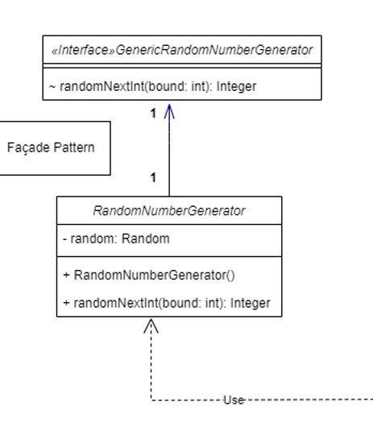
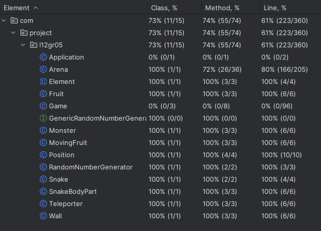
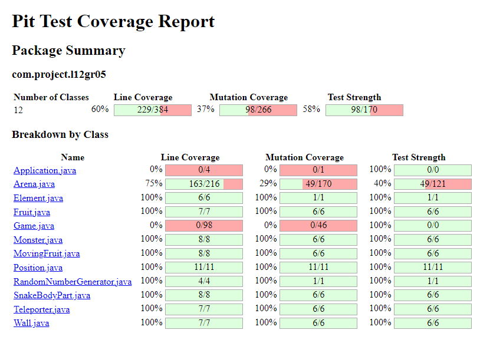

# project-l12gr05

## Game Description
Snake is a classic phone game where the player controls a snake and eats fruits spawning randomly throughout the map to grow. To win the game the snake needs to occupy the entirety of the map without hitting the map’s border head on or hitting itself, which kills it.

Our game is basically snake but in hard mode, where monsters that move randomly and can kill the snake if hit directly appear, some of the fruits move randomly which makes them relatively harder to eat and two teleporters are placed on determined locations on the map, enabling the option to travel from one place to another but making it possible to died directly after the teleport if the way is obstructed.

This project was developed by:
- Liess Pereira Aouimeur (up202206296@up.pt)
- Rodrigo Pinto Pesqueira Gaspar Pombo (up202105374@up.pt)
- Fernando Manuel de Melo Oliveira (up201005231@up.pt)

## Game Help

Due to not having a menu all the explanations about the game are going to be made in this section.

To start things off, the player needs to know what each of the letters appearing on the game mean:
- Black X: head of the snake, the character controlled by the player;
- Grey s: tail of the snake, which moves accordingly to the head, following the steps of the previous character to them specifically;
- Black M: monsters, which moves randomly and kills the snake if the head of the snake collides directly  with it;
- Red o: static fruit, which can be eaten by the player and doesn’t move;
- Red F: moving fruit, which can be eaten by the player and moves randomly;
- Black T: teleporters: which have a fixed spawn location and teleport any moving object, that being the snake, the monsters or the moving fruit, accordingly to the position one entered the teleporter;
- Grey #: wall, defines the border of the map and kills the snake if the head of the snake collides directly with it;

Secondly, the player needs to know the game controls:
- w or up arrow: makes the snake go up if it wasn’t going down beforehand;
- s or down arrow: makes the snake go down if it wasn’t going up beforehand;
- a or left arrow: makes the snake go left if it wasn’t going right beforehand;
- d or right arrow: makes the snake go right if it wasn’t going left beforehand;
- e: exits the game and closes the window;

In addition, the player needs to know some of the mechanics, them being the fact that each time a fruit is eaten, independently of the type of fruit, the snake grows one block, the fact that the snake can’t go in the opposite direction it is going at the moment, which means that if the snake is going up for example, it cannot go directly down because it would go inside it’s tail, the fact that a fruit and a monster cannot be in the same block and the fact that there is always five static fruits and three moving fruits in the arena, being replaced immediately after being eaten (is there is place for the fruit to be spawned).

Finally, the game is infinite, there is basically no ending, the objective is to get as big as possible without dying, which is the case for the normal snake as well.

## Implemented Features

“Go up”: if the snake wasn’t going down beforehand, it will go one block up if the up key or the w key is pressed; 

“Go down”: if the snake wasn’t going up beforehand, it will go one block down if the down key or the s key is pressed;

“Go right”: if the snake wasn’t going left beforehand, it will go one block right if the right key or the d key is pressed;

“Go left”: if the snake wasn’t going right beforehand, it will go one block left if the left key or the a key is pressed;

“Eat fruits”: when the head of the snake is on the same block as a fruit, the snake eats it;

“Snake collision”: if the snake collides with the border, itself or a monster it dies; 

“Close game”: closes the game if the e key is pressed; 

“Snake grows”: for each fruit or moving fruit the snake eats it grows bigger by one block, and we also covered the edge case scenario where the moving fruit would go against the snake just after the snake ate another fruit or moving fruit;

“Monster movement”: monster move randomly;

“Fruit movement”: moving fruit move randomly;

“Teleporters Interaction”: depending on which side the player, the moving fruit or the monster enter the portal they’ll leave the other portal in the corresponding direction (entering on the right side of one portal and leaving on the left side of the other)

## Planned Features

“Menu selection”: moves the menu selector by using the up and down or w and s keys and selects by pressing the enter key;

“Choose position of wall block”: in the level creation menu, select a case in the grid to place a wall using the up, down, left and right keys or the w, a, s and d keys;

“Choose speed of the game”: in the level creation menu, in the speed selection area, select the speed of the game using the up and down keys;

## Design

### Façade

#### Problem in Context:

We couldn't create a mock for the Random class, so we needed to call it directly in the Arena class, which is not good practice. To solve this problem we created a façade class that calls the Random class and returns the value we need.

#### The Pattern:

By implementing the façade pattern we were able to hide the Random class from the Arena class, making it easier to test the Arena class.

#### Implementation:

The RandomNumberGenerator class has a method called nextInt that returns a random integer between 0 and the parameter passed to the method. This class also implements the GenericRandomNumberGenerator interface, which has the nextInt method.

  

  <b><i>Fig 1. State pattern screenshot </i></b>

## UML diagram

[Link to the UML diagram](https://viewer.diagrams.net/?tags=%7B%7D&highlight=0000ff&edit=_blank&layers=1&nav=1&title=projeto_ldts_UML.drawio#R7V1rc5s4F%2F41nsm%2BM94xV9sfE6fJdrftpk2vnzrEVmw22HgBN3U%2F7G9%2FxUUYpAMGgpAv2unMBgzY6DmP9Jyjo6OeNln%2BvPWs9eKtO0NOTx3Mfva0656K%2FzMV%2FL%2FwzDY%2BMxwN4hNzz57Fp5TdiXv7F0pOkss29gz5uQsD13UCe50%2FOXVXKzQNcucsz3Of85c9uk7%2BW9fWHDEn7qeWw579Ys%2BCRXx2pA535%2F9A9nxBvlkxx%2FEnS4tcnLyJv7Bm7nPmlPaqp0081w3iv5Y%2FJ8gJG4%2B0y5fX2y%2FOmyfz9s%2F3%2Fr%2FWp6u%2FPr773I8fdlPnlvQVPLQKGj%2F619PjzR%2Bf9X%2B%2Bru9u3j8Pbi8f%2Fuwntwx%2BWM4maa8vVnhX9L7BljSi%2F2wvHWuFj64e3VVwn3yCm%2BDKcuz5Cv89xb8NefjED%2BQFNm7%2Fy%2BSDwF3js9OF7czeWFt3E76BH1jTJ3J0tXA9%2Bxd%2BrOXgjxR8An%2FsBYkpqWbuivvwTnx6gM96yMfX3JFmUdJTbyw%2FSK6Zuo5jrX37IfrB4SVLy5vbqys3CNwleZC7Wc3QLDlKcY4OAs99Si0nvL8iGAloYWugnxlTTMC5Re4SBd4WX5J82jfGCRoJ04jdPe%2FMNmXVImOy5DYrYco8fXT6bR8ws6zVHLdB%2BnWqlv82RWe%2FTjGBr8OA5L7OcjDuKytAV2Er%2BlkbxH9k3nR3KrLMGlaqMFbaUzEOg9BWL%2FD7XIYPwGiok%2Fh9kuPfGDvGUAQZm3XQY1Bosf7amtqr%2BZvommt9d%2BZD0hbhKRff%2B%2BhE1rKwZzO0iqwpsAIrNrjQhNYu%2Fi1RYxlX%2BB9u0sngd6NnXIe%2F17hSdsf4X3i5F0zcFTY8y44sDGFrfkahRQO2V8rq%2Fba3zWO6z9Ro7LOmlgO9LsI6gDCFnWNH%2Fc8iWO66CZqbe4BdYojCxxEkP4ZAX%2FcVBm2NRVsDkHWsB%2BTcub4d2G74fC%2B%2BlkJcFKiGWg3UESdMjQLWzjzr%2BcKfeihkS0jVj5iVkfqwp%2F5v8akfLn60ZG81oM2KAwU39ipDBuqUFRWlxEBKifakhDbYryQGJmsgSjMpYRhHJCVGjKn24zdJRcR59joph18kGiCr4tftjEEst6eLZUnvkuiiAU%2FEIUXRKeKqJnVi%2B7AOR9Vg5SUUVUj9h0qRNJn08dqAeSS6v1aLPII5Cr5e%2FHa63TY3SBWlwx75avr%2B6f3nt58e5pulbb4abPwbv68UcRdj%2Bk1i2gRTrWJ3zA%2FTIp6ifzeW41%2B4Map%2FP%2FyDfYEE4gfXdZDFunsS5iKYTV00zAzKH5GDwsbAzndFt13OALTotvc1hXKkz3IKADRWtaBL2pnsmYvEUoof5EQA%2BIulg9c%2BqB1OBIA%2FuEgiyomAloHuciIA%2FMUmg%2FT9ynrCw8Jsiwdp1gmQqkJAXoGiSVWR2Cs7bxX3TDmrlcKimOjHIyzYeR8pLF4Kqmhhwc7%2FSGHBBWjhwoJ8Ga0spKIQoiio9IKxFBTETtmg2n9ET0gdUcLr4xESZMpFKok2YRUtJRQo8CS1BA%2BoxYsJNkzx1v2BW%2FvG29gySCFCUqjUzIc6rGgk6Qz4CWuKoihFxmiltiih%2BRFpCxml4ACrcG0h4xRdQS1cW6hsoCLGeombmORDFS6OkLjWyF3sFlfWsX8bNoJMlRGUKkMvcZGCcWerUIQiFoyRxUqxWMLv4xGLcjEED1hFi8XCxRBSLLYNtXixWJRoLcXiS3AVLxbZAKMMLR5M%2FpMKSLczna5Ui0KLMqi4j9pHpBNlUJEDrMJ1ogwqdgW1cJ2osUHFW2tZOflJ1lZpUU7oZn5410dARzAEraOkKyiWEwdaXAW2UzZIGhbkyHZG9%2FHfZ9r3pER%2BkXqArYtX38MGE0NMwze1Ykgvoz9PDdGmpVZawh2SF93izqrGMJPRwS30FkPxerUOB4UQf7TaLDOfSEto1xKg6izdWoKMM3OAVRkA6%2F8hXHk5EBobaA479rXnTpHv%2F4W2F08ocfjxwX0Ep3QfmiANFWnplsFFcebQi7iQoDYBFarS0i2obJC5T9x%2FCWkTSKGKLN1CyoZjQ0inCzR9igRXcZd8PvV32kIbWrTEC%2B33m9HnNZq%2F%2BXX35knR7cWHzQcFqI8cgm37nzFYs8nC8qwp9tjPGncGzsqmUOxQK8I96qLIrbdZyZ67UZBEF62wSFAug%2BkrBy0RUPhOzvkKWKEK9PU6YB%2BpBDjdKV8djtGuU0dZ5pxk6PyiOC1kYfx6IDZOy6B37lGa%2BrBCYVgI1haCNKBGBNaTx1ohGV3OMEWjiSbUyzUhNMHLi7wwzBB5kyq6aRHs88gH5AAvlA%2FYLbxFi8v9DLzwCHz6%2FgAHwMGIa7ej8YvLCUzU3uXgwnoIW256sp05hyEbjMx2Cz47swLPkct8nS5Wiul550wHRvshKWOfcwZVvZE3eEwZO3rRzFDyW8%2Bnen85k1%2FiB4LGxa%2FzYaeFYkTJt58qpK2madQHHvAUOwa%2BKJffjwrlxdl3YM08ifyLkAcSdLpFnowlDPJBWhzfj%2FF%2FY%2BMGU00nbLXsZg%2FmfNcpSsNoyzCgFJ9uLcMommryswWOAeOgynZL%2B%2BBiH0Ah7o7tA1oaFMk%2Fy3EAs4g3h5fWwMUaDNHS0ShSEI%2FhakDAHJJFrdIeuNgDsLCkY3sociWWcR0RwCLSmjjSJrh4lwPRWtMoKVlAihGCdpGpryltg4ttaMLVZlHpkpzavJzNrtDU2vjo78eMWdxiIOaXc9ysfnC%2F81hlpIJDiEq07NTlinQeuALznCCu3Pb5Yr3NcMlYNPdxQQeUJ2xI8nwnuepjPRbe2RcFnUpnOGPc2YjkpEm0alLVUU2%2Fs37EA9%2BKWzDcmFO7qiF7J80U0aSqs3X6aQEcSKMBaaAgaciEXfukKUrnCgt%2BxZuEnGsaCA%2B8hQsdMilEL%2BjxkBWgTA%2Fgy7z%2FRgBXVTz8AGbzfKLqCLPZO%2FScrc8v8W2Arw7kcXWL7xBekTdHQWbj6dIuu2RPdYl7Ee5AClfHuMOLa2NeS0Y3RxZYY8sNWTgXl%2FVbskNyrPAJuOcU2i6AsrIZFGMOrLTtFnM2LrGDfNc%2Fg6ifQZYEN%2BANYKltx904vMYaD99%2FBwvkZcbwXfCBHrblON48Jw5Yl9uxAcBFbnL67Rq3gr2yokUYxWYQB2fsFdZ2lvMdxcuvvpdKvxNfqcPDYEzhwg926DbrGR4roggNFoBpGDGV%2Ft8D9zsWhzTucYTSjwTjxHUcNA3QjCrckFyTcRbhK6XebGJQwuPkQzYEFIf88EvYj9s07ByCbvvYalIZctqlPTiAbVaN7%2FIDuyi%2BG4OduBAS6pdDrQuXlgV%2BpLWKKB1WwiwPDEnM62JOulJxifZljmRuAhH0Jc8jqZof%2FmPR4tAsSpcOp%2B8%2Brc9khT6PJTSqaJlmFuU%2Bh9Beu8%2FnUn6BB7iGaFlmFicy%2F0AhCBLcxuAORQsxs2wTtajJJbpN0R0NhEsuOIAXS64wywtUWie9Tokf2qpwgVVUNiX2n0NYpfP8cpwN4WqLDYrtWC0zol4A7Ui41oLrS07jmHYudUIStya644FosTWCJ1QTdIGEN4lxXYzJhkvCsiXKPOG3Gyew1w5Kyk%2F6H6zVzF0624tkQhTIW%2B9pN%2FgMhhtFNYxI5crzyWTnkFkxNjpUaqCRwPlxmXKVH90wBJ6ATZtJjHny4Xl4ZzysYCRax5El6uwkSILt%2Fdp63lPaUo4QNUcIZaCITqhj4%2BB52KPZrx2h0%2BriZwE5B6YrA0248ts3tZ1LX8l76Cc8uHPhN3GPxYFdMLkdbkREaP3ODV6vqElP2dG3awgj0QG5YcGMN2MISdBGGkCrBqAoohXesGCoZwwgt5pRmkG7ZgBUEO54QKhqBvGUjMS%2FXfxN4eqvZGfCHP7Z5TTSCtq1grFwWQhHfaDBIFlHJ02gVRNQFdFxP9YxiGN77zbLB%2BTdohXyrMD1GEzlrnf0Vgd7wgTFux%2Bw5kG2OjBJwYs0YxbY2IgEj3JbHZCF9iex7x287hfsurzIeOPuKDbkE%2B2N9lhbMdcLOyNoxzvItrh1RWzsmcHuxIvItQ8qtN8dBCqv%2Fe6K8n%2FAQebiVAvGtY8rtMNdp2QtKg0ad8DvMGyvV8HFQ9j9Z%2BoBRn%2FhD9D8ZJddt481tN1dp1grUEYuBR5azS49L2prdx21ND5zYzukn8ZHiXxT1HwPnpdauKG87dfswbfw4HdTNciJ65%2FZj6%2B32aM75Nn4pUPZGZ%2F8aQdfyU%2FAf8cPM5Kj3ZPCA%2FKg%2BN3QbI4aiDncKO7Gm6Ky5kxaD0vaOUoe%2BOvp8eaPz%2Fo%2FX9d3N%2B%2BfB7eXD3%2F2%2B6oG2wWkxjzkWIH9I%2F%2BTS9TfnRtV7STKTxlTyk%2BhRoT4rZK7dvbEPEijN8uiHxS%2FNfOg1mQh69IqjLFSPU3qqGQ9GaWCdihXCrE0mbiOG1rjyo2kC8f%2BJ8OpSl1RA49EHeXRBbIT1U57JjaMJdFuDW26UwDW3neKtgqpSQpscGCJen%2FcnxO0cbMu3Lm7spxXu7NXM8tf7Fz%2BMOBARrQEzcwY9%2BC4YdCBHtbyRtDD%2FjT%2Bb6SWjGv7RzUyih7AcAaOUgo7mpVsVF86mhmANRmNBjiMk7XNXJAQr3D866eKKi00UTrM7bke%2FxH%2FAvjuIUm7TUv9UwVqq462BhWwYR7EebRVITfgaBh5QMwCGaMeMmGUASX0EiVayBhaGOav38OYPiU8UvrVZUzRz%2BiMMRV8qcNlzAmMYXBWxEmMYfTOyIq5ZxCjb6g1iPU1anaC5BbVpqRW%2FhzejIQWk0tGih77TpOSxLh5UZIa3UZNKamWP4c3JaElS8dGSaUNSu5o%2BC3LQjGUrOzp7Y9bihSuY9j5KuKCasI%2BVtXrlaSIXFUKUx3AuCmFlfLn8KZwhS3BDpfCMBXV6lxs2gvw5jAxiiPlcLpbVgEFD5LS1JicHtdl9JD6EeNuPVei0o%2BT0ac6KJP5riMlNJk1VA55TNYGLTHYpMO19IN4Uxha8yeGwmGSwMeFvWrm7e6I%2By1L6qNlMUkd3stipSBV5CBYTGZj011%2FyklpGGWX7%2BEkpW71pjMotNxmHsSbkuqRU%2FKl1MqSWqnHaiDf52CIqp4QUbXy6%2FcwlZq50ekJl8pMpUZhfdAxUw8n%2B0AMU7vh1mlQBvMfHlcqRoHo2dXGrGF%2BiDbqmDZsisD%2FGN7IFK1y9rCkIJ2iSqObdEqicrQ0dn5bZuS1Brd5aGizc6eS3K2hXdx3C8P7cCbmZAChWQDhhDQWPfjVvkHV96o4o%2ByGfSpOp1Wc2lTFaaSEFOkJ9I5V3OFM54kOU9SbQTgY4sc5FSfCfHNYk%2Fn0DVQezl4iF3xffSKbdBc07JjIbAGw4yJymwlvRzmCSx5nblCGtQZkg542aDwg62TzOkEDMvm6o%2BXxcfBR8ix5rXrDJZGLL6aZMQZ%2FR2csYyfMZXyjLtlK4ht0PgRQCLvT%2BAbZ317izaeeFTX8Cl8%2FrrNzehJvfngrUP2yTvGWk1Fd4g1VKeoUbnYy6nK9djBo4MYksqYh%2F5qGOiXoRkCJQbC6EZ3tfHoVDfWiXW0zNitLpDH0Zk1tm4dQXI20CrNlsqJhXVhFlzTUCzeNx41wcR94uHnjFjr93VI4wCu8siGJ4BxtZK3VpS7ZeJzgJeEkVXr%2FUpdDDpHrVA6PYdRZiqLTZYfosHPVyJquUyG6juugGGxkTeaJtaay6cQISGR32qeycTWJdmtoa0M93ymoouFmw2oS7tbg1ukSIcLhBqrATdTe5dXrENJHC4%2Fq%2BPDqKir0bU%2FlBhOHEozpm0NtvylB4RFaLZxeNMaoUBZKOu8FfUGtmAwEOC%2Fn3WCd9%2F96smo9D6jJwp99UPMblk4l1e133dCzzrzyu6LwT3jjvb62bDuqrItfwuMDdfH7BrW0ncyLFae5lN%2BwN62NKjFjmkb%2Blarn25DNCYggGFFP4hwWIB2E9By46D2DWoxtiE7AMGUYqEu8TdGBILKMJYP3jdWbaL3LoTULPYU7KwilfdlA%2FbywA3S%2FtqKB5Nmz1jxbcEiF0swB4LJA8xN0aZ%2F2mpANrnzyEdNg4IY8WeWR6helV7YfT4OJgKxyUcZ55TLQRnuVi4C6HiRAuVd47M8KbmtLnr5JrR4bN655TkeMmCcVjOr1hQ%2BVFT8qK%2FLemmZgs3y6IISYXPVaU6ocrJJOyB6SJei1t64Y54PWQ4N6UGOliQ891w2yl%2BNBYvHWnaHwiv8D)

## Code Smells

The Arena class and Game class have too many methods, many should have been created in different classes;

The methods CheckInput, isValidCharacterInput and processKey in the Game class are too long due to switch statements and if statements;

Some methods have really long conditions, making them harder to read, an example would be the canElementMove method in the Arena Class;

## Testing

### Coverage Report

### Pitest
 

[Link to mutation test report](PitestReport)

The Snake class didn't appear in the pitest report for unknown reasons. We didn't find a way to fix it.

## Self-evaluation

Liess Aouimeur and Rodrigo Pombo contributed an equal share to the work. We (Liess and Rodrigo) worked together so it is not possible to differentiate who did what. In percentages it would equal to:

- Liess Pereira Aouimeur - 50%
- Rodrigo Pinto Pesqueira Gaspar Pombo - 50%
- Fernando Manuel de Melo Oliveira - 0%

Fernando did not contribute to the project, he was not present in any of the meetings and did not do any work.

In the intermediate delivery we had initially put that everyone had contributed equally, because the delivery was small and the work was done in a single meeting where only Liess and Rodrigo were present. So we decided that it was unfair to put that he had done nothing in the intermediate delivery, because Fernando could have simply not been available at that specific time and we decided it wasn't fair to penalize him for not begin able to attend one specific meeting.

However we did not expect for this situation to happen again and him to not attend any of the meetings and not do any work, so we decided to put that he did not contribute to the project in the final delivery.